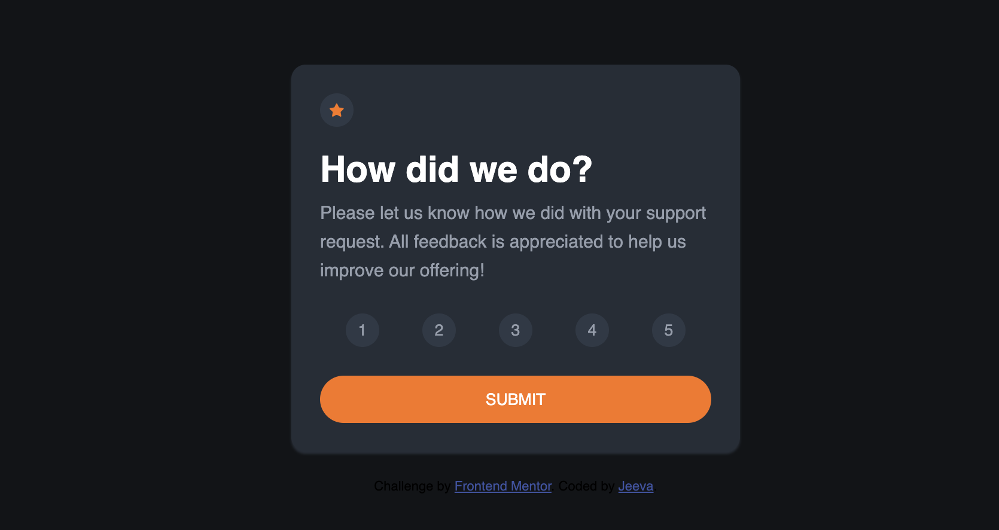
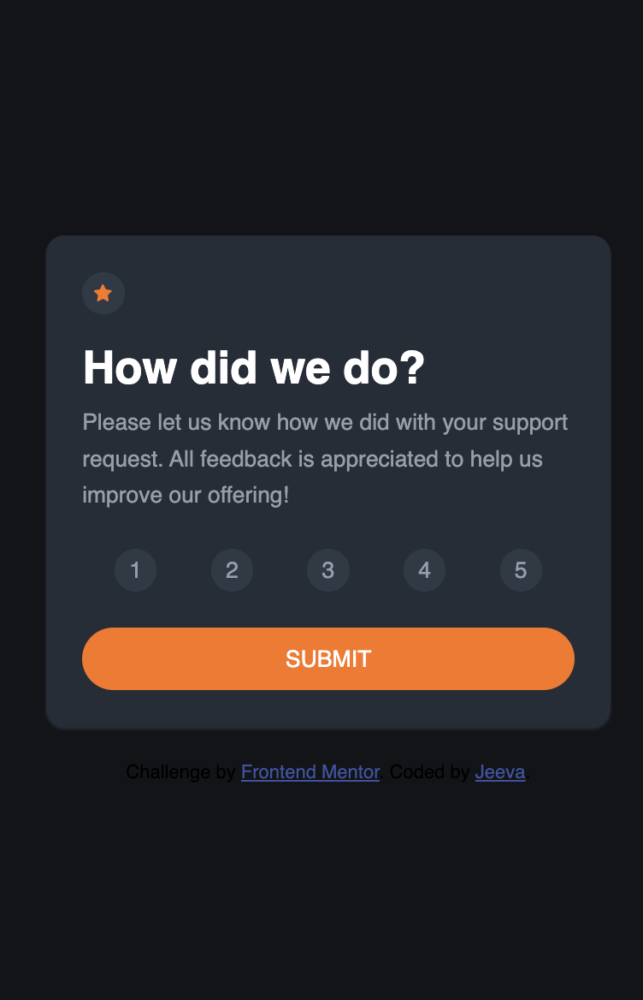

# Frontend Mentor - Interactive rating component solution

This is a solution to the [Interactive rating component challenge on Frontend Mentor](https://www.frontendmentor.io/challenges/interactive-rating-component-koxpeBUmI). Frontend Mentor challenges help you improve your coding skills by building realistic projects.

## Table of contents

- [Overview](#overview)
  - [The challenge](#the-challenge)
  - [Screenshot](#screenshot)
  - [Links](#links)
- [My process](#my-process)
  - [Built with](#built-with)
  - [What I learned](#what-i-learned)
  - [Useful resources](#useful-resources)
- [Author](#author)

## Overview

### The challenge

### Screenshot




### Links

- Solution URL: [Frontend Mentor](https://www.frontendmentor.io/profile/digitaltamildev)
- Live Site URL: [Github](https://digitaltamildev.github.io/Interactive-rating-component/)

## My process

### Built with

- Semantic HTML5 markup
- CSS custom properties
- Flexbox
- Mobile-first workflow

### What I learned

```js
console.log("Need to spend more time on learnig JS.");
```

### Useful resources

- [MDN Documentation](https://developer.mozilla.com) - This helped me for any quick references.
- [Freecode camp](https://www.freecodecamp.org/news/full-javascript-course-for-beginners/) - Full JavaScript Course for Beginners.
- [Traversy Media](https://www.traversymedia.com) - This is an amazing resources, helped me lot.

## Author

- jeevatek - [jeevatek](https://tek.jeeva.ca)
- Frontend Mentor - [@jeevatek](https://www.frontendmentor.io/profile/jeevatek)
- Twitter - [@jeevatek](https://www.twitter.com/jeevatek)
